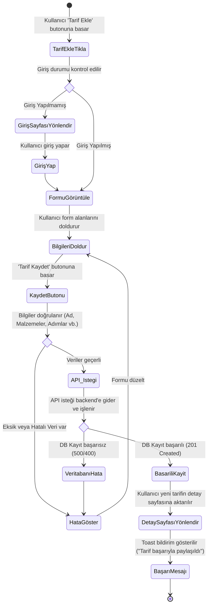
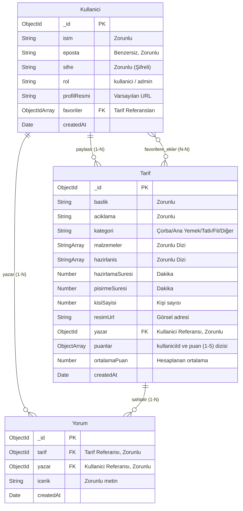
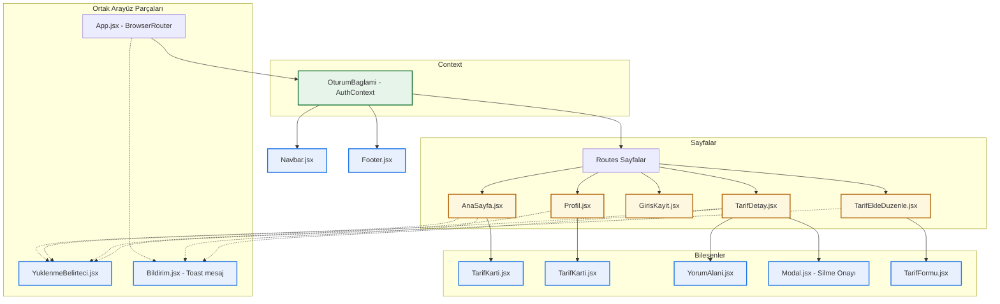

# UML ve Tasarım Dokümantasyonu - "tarifim"

Bu dosya projenin Use-Case, Activity, ER (Veritabanı) ve Bileşen İlişkileri diyagramlarını içerir. Diyagramlar görsel olarak render edilebilmesi için Mermaid formatında hazırlanmıştır.

---

## 1. Use-Case (Kullanım Senaryosu) Diyagramı

Use-Case diyagramı, sisteme erişen kullanıcı türlerini (Misafir ve Giriş Yapmış Kullanıcı) ve yapabilecekleri temel eylemleri gösterir.

```mermaid
left-to-right-direction
actor "Misafir Kullanıcı" as Misafir
actor "Giriş Yapmış Kullanıcı" as Uye

rectangle "Tarifim Sistemi" {
  usecase "Tarifleri Listele / Ara" as UC_Listele
  usecase "Tarif Detayını Oku" as UC_Detay
  usecase "Yorumları Oku" as UC_YorumOku
  usecase "Kayıt Ol / Giriş Yap" as UC_Giris
  
  usecase "Tarif Paylaş (Ekle)" as UC_TarifEkle
  usecase "Kendi Tarifini Güncelle / Sil" as UC_TarifDuzenle
  usecase "Tarife Puan Ver (1-5 Yıldız)" as UC_PuanVer
  usecase "Tarife Yorum Ekle / Kendi Yorumunu Sil" as UC_YorumEkle
  usecase "Tarifi Favorilere Ekle / Çıkar" as UC_Favori
  usecase "Kendi Profilini Görüntüle" as UC_Profil
}

Misafir --> UC_Listele
Misafir --> UC_Detay
Misafir --> UC_YorumOku
Misafir --> UC_Giris

Uye --> UC_Listele
Uye --> UC_Detay
Uye --> UC_YorumOku
Uye --> UC_TarifEkle
Uye --> UC_TarifDuzenle
Uye --> UC_PuanVer
Uye --> UC_YorumEkle
Uye --> UC_Favori
Uye --> UC_Profil
```

---

## 2. Activity (Aktivite) Diyagramı

Aşağıdaki aktivite diyagramı, bir kullanıcının sisteme yeni bir tarif ekleme sürecindeki iş akışını (validasyonlar ve sunucu doğrulaması dahil) gösterir.



---

## 3. ER (Entity-Relationship) Diyagramı

ER diyagramı veritabanımızdaki 3 ana tablonun (Kullanici, Tarif, Yorum) yapısını ve aralarındaki ilişkileri gösterir.



---

## 4. Bileşen (Component) İlişkileri Diyagramı

React frontend mimarimizin bileşen yapısını, durum yönetimini (Context) ve sayfaların hiyerarşisini gösterir.


